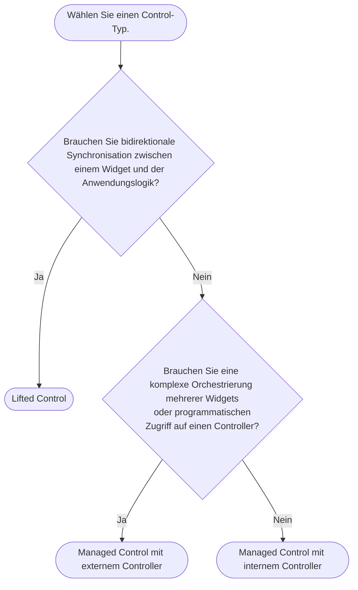

import {Callout} from "fumadocs-ui/components/callout";
import { CodeSnippet } from '@/components/code-snippet/code-snippet';
import liftedSnippet from '@/snippets/snippets/concepts/controls/lifted.json';
import managedSnippet from '@/snippets/snippets/concepts/controls/managed.json';

Controls sind Abstraktionen über Controllern wie `TextEditingController` und legen fest, wo der Zustand lebt.
Statt Controller an Forui-Widgets zu übergeben, übergeben Sie Controls (die optional Controller umschließen).

Es gibt **2** Arten von Controls.

## Lifted

Sie verwalten den Zustand extern. Das Widget ist "stumm" und spiegelt lediglich die übergebenen Werte wider.
Das entspricht den [controlled components](https://react.dev/learn/sharing-state-between-components#controlled-and-uncontrolled-components) in React.

<CodeSnippet snippet={liftedSnippet} />

## Managed

Das Widget verwaltet seinen Zustand intern, entweder über einen internen Controller, der mit den übergebenen Anfangswerten konfiguriert ist,
oder über einen extern übergebenen Controller. Im letzteren Fall sind Sie für den Lebenszyklus des Controllers verantwortlich.

<CodeSnippet snippet={managedSnippet} />

## Wann nutzt man was?

<Callout type="info">
    **Kurz gesagt**: Beginnen Sie aus Einfachheit mit "Managed mit internem Controller" und wechseln Sie bei Bedarf.
</Callout>

### Typische Szenarien
* Lifted:
  * Synchronisierung des Zustands zwischen Ihrer State-Management-Lösung (z. B. [Riverpod](https://riverpod.dev/)) und dem Widget.
  * Auf jede Zustandsänderung reagieren und den Zustand ggf. anpassen.

* Managed mit externem Controller:
  * Verwendung einer Lebenszyklus-Lösung wie [Flutter Hooks](https://pub.dev/packages/flutter_hooks).
  * Aktionen programmatisch auslösen, etwa das Anzeigen eines Popovers.

* Managed mit internem Controller:
  * Prototyping.
  * Schlichtes Festlegen eines Anfangswerts.
  * Passives Beobachten von Zustandsänderungen.
