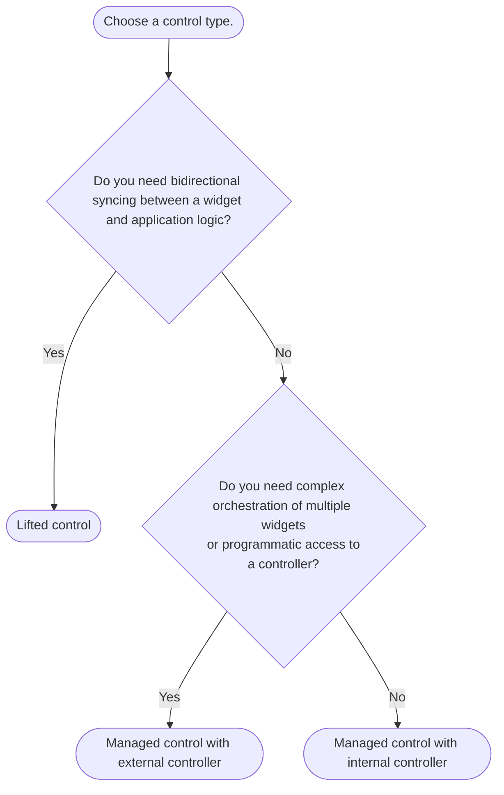

import {Callout} from "fumadocs-ui/components/callout";
import { CodeSnippet } from '@/components/code-snippet/code-snippet';
import liftedSnippet from '@/snippets/snippets/concepts/controls/lifted.json';
import managedSnippet from '@/snippets/snippets/concepts/controls/managed.json';

Controls are abstractions over controllers, e.g. `TextEditingController`, that define where state lives.
Instead of passing controllers to Forui widgets, you pass controls (that optionally wrap controllers).

There are **2** types of controls.

# #Lifted

You externally manage the state. The widget is "dumb" and just reflects the passed-in values. This is similar
to React's [controlled components](https://react.dev/learn/sharing-state-between-components#controlled-and-uncontrolled-components).

<CodeSnippet snippet={liftedSnippet} />

## Managed

The widget internally manages its own state, either through an internal controller configured using the passed-in initial
values, or through a passed-in external controller. In the latter case, you are responsible for managing the controller's
lifecycle.

<CodeSnippet snippet={managedSnippet} />

## When to Use Which?

<Callout type="info">
    **TL;DR**: Start with "Managed with internal controller" for simplicity and switch as needed.
</Callout>

### Common scenarios
* Lifted:
  * Syncing state between your state management solution, e.g. [Riverpod](https://riverpod.dev/), and the widget.
  * Reacting to every state change and potentially modifying the state.

* Managed with external controller:
  * Using a lifecycle management solution, e.g. [Flutter Hooks](https://pub.dev/packages/flutter_hooks).
  * Programmatically triggering actions, e.g. showing a popover.

* Managed with internal controller:
  * Prototyping.
  * Simply setting an initial value.
  * Passively observing state changes.
