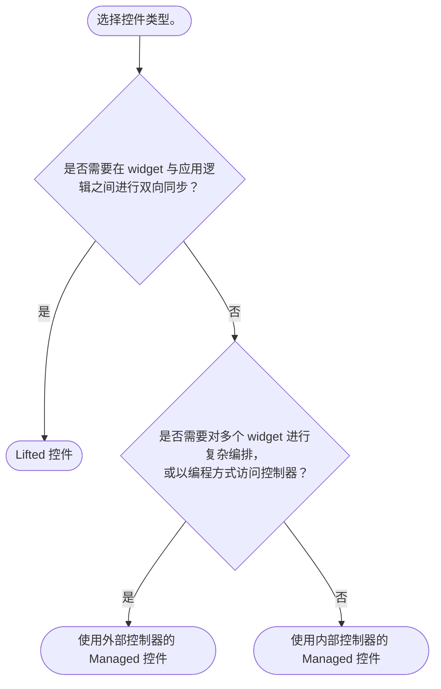

import {Callout} from "fumadocs-ui/components/callout";
import { CodeSnippet } from '@/components/code-snippet/code-snippet';
import liftedSnippet from '@/snippets/snippets/concepts/controls/lifted.json';
import managedSnippet from '@/snippets/snippets/concepts/controls/managed.json';

控件是对控制器（例如 `TextEditingController`）的抽象，用于定义状态的存放位置。
你不再向 Forui widget 传入控制器，而是传入控件（控件可以选择性地包装控制器）。

控件共有 **2** 种类型。

## Lifted

由你在外部管理状态。widget 是“被动”的，只反映传入的值。这与 React 的[受控组件](https://react.dev/learn/sharing-state-between-components#controlled-and-uncontrolled-components)类似。

<CodeSnippet snippet={liftedSnippet} />

## Managed

widget 在内部管理自己的状态，可以是基于传入的初始值在内部创建一个控制器，也可以是接收一个外部传入的控制器。
后一种情况下，由你负责管理控制器的生命周期。

<CodeSnippet snippet={managedSnippet} />

## 何时使用哪一种？

<Callout type="info">
    **简而言之**：从简单出发，先使用“Managed 搭配内部控制器”，需要时再切换。
</Callout>

### 常见场景
* Lifted：
  * 在你的状态管理方案（例如 [Riverpod](https://riverpod.dev/)）与 widget 之间同步状态。
  * 对每一次状态变化做出响应，并可能修改状态。

* Managed 搭配外部控制器：
  * 使用生命周期管理方案，例如 [Flutter Hooks](https://pub.dev/packages/flutter_hooks)。
  * 通过编程方式触发动作，例如显示一个浮层。

* Managed 搭配内部控制器：
  * 原型设计阶段。
  * 只需设置一个初始值。
  * 被动观察状态变化。
