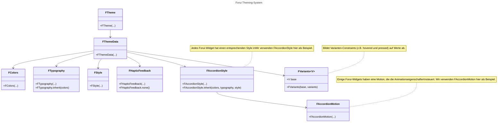

import {Callout} from "fumadocs-ui/components/callout";
import { CodeSnippet } from '@/components/code-snippet/code-snippet';
import gettingStartedSnippet from '@/snippets/snippets/concepts/themes/getting_started/getting_started.json';
import componentsSnippet from '@/snippets/snippets/concepts/themes/components/components.json';
import colorsSnippet from '@/snippets/snippets/concepts/themes/components/colors.json';
import typographySnippet from '@/snippets/snippets/concepts/themes/components/typography.json';
import styleSnippet from '@/snippets/snippets/concepts/themes/components/style.json';
import variantsSnippet from '@/snippets/snippets/concepts/themes/components/variants.json';
import variantsDeltaSnippet from '@/snippets/snippets/concepts/themes/components/variants_delta.json';
import customFontFamilySnippet from '@/snippets/snippets/concepts/themes/components/custom_font_family.json';
import approximateMaterialThemeSnippet from '@/snippets/snippets/concepts/themes/material_interop/approximate_material_theme.json';

export function Theme({title, color}) {
    return (
        <div className="flex items-center space-x-2">
            <div className="h-4 w-4 rounded-full" style={{backgroundColor: color}}/>
            <p className="font-medium">{title}</p>
        </div>
    );
}

Mit Forui-Themes definieren Sie einen einheitlichen visuellen Stil für Ihre gesamte Anwendung und alle Widgets.
Das Theme-System nutzt optional das [CLI](/docs/reference/cli), um Themes und Styles zu erzeugen, die Sie direkt in Ihrem Projekt anpassen können.

## Erste Schritte

<Callout type="info" title="Theme-Helligkeit">
    Forui verwaltet die Theme-Helligkeit (hell oder dunkel) nicht automatisch.
    Sie müssen das Theme in `FTheme(...)` ausdrücklich angeben.

    <CodeSnippet snippet={gettingStartedSnippet} />
</Callout>

Forui bringt vordefinierte Themes mit, die sofort einsatzbereit sind. Sie sind stark an [shadcn/ui](https://ui.shadcn.com/themes) angelehnt.

| Theme                                     | Heller Zugriff          | Dunkler Zugriff        |
|:------------------------------------------|:------------------------|:-----------------------|
| <Theme title="Neutral" color="#171717" /> | `FThemes.neutral.light` | `FThemes.neutral.dark` |
| <Theme title="Zinc" color="#18181b" />    | `FThemes.zinc.light`    | `FThemes.zinc.dark`    |
| <Theme title="Slate" color="#0f172b" />   | `FThemes.slate.light`   | `FThemes.slate.dark`   |
| <Theme title="Blue" color="#1447E6" />    | `FThemes.blue.light`    | `FThemes.blue.dark`    |
| <Theme title="Green" color="#5ea500" />   | `FThemes.green.light`   | `FThemes.green.dark`   |
| <Theme title="Orange" color="#f54a00" />  | `FThemes.orange.light`  | `FThemes.orange.dark`  |
| <Theme title="Red" color="#e7000b" />     | `FThemes.red.light`     | `FThemes.red.dark`     |
| <Theme title="Rose" color="#ec003f" />    | `FThemes.rose.light`    | `FThemes.rose.dark`    |
| <Theme title="Violet" color="#7f22fe" />  | `FThemes.violet.light`  | `FThemes.violet.dark`  |
| <Theme title="Yellow" color="#fcc800" />  | `FThemes.yellow.light`  | `FThemes.yellow.dark`  |

Jeder helle und dunkle Zugriff enthält außerdem Desktop- und Touch-Varianten mit Schriftgrößen und Abständen, die für die jeweilige Plattform optimiert sind.
So ist `FThemes.neutral.light.desktop` etwa die Desktop-Variante des hellen Neutral-Themes,
während `FThemes.neutral.light.touch` die Touch-Variante darstellt.

Weitere Details finden Sie unter [Responsive](/docs/concepts/responsive).

## Theme-Bestandteile



Das Theme-System von Forui besteht aus **8** Kernkomponenten.

- **[`FTheme`](https://pub.dev/documentation/forui/latest/forui.theme/FTheme-class.html)**: Das Wurzel-Widget, das den Theme-Daten an alle Widgets im Teilbaum bereitstellt.
- **[`FThemeData`](https://pub.dev/documentation/forui/latest/forui.theme/FThemeData-class.html)**: Hauptklasse, die Folgendes enthält:
  - **[`FColors`](https://pub.dev/documentation/forui/latest/forui.theme/FColors-class.html)**: Farbschema mit Primär-, Vordergrund- und Hintergrundfarben.
  - **[`FTypography`](https://pub.dev/documentation/forui/latest/forui.theme/FTypography-class.html)**: Typografie-Einstellungen mit Schriftfamilie und Textstilen.
  - **[`FStyle`](https://pub.dev/documentation/forui/latest/forui.theme/FStyle-class.html)**: Sonstige Optionen wie Eckenradius und Icon-Größe.
  - **[`FHapticFeedback`](https://pub.dev/documentation/forui/latest/forui.theme/FHapticFeedback-class.html)**: Haptik-Callbacks, die von mehreren Widgets gemeinsam genutzt werden.
  - **[`FVariants`](https://pub.dev/documentation/forui/latest/forui.theme/FVariants-class.html)**: Bildet Varianten-Bedingungen
    (z. B. hovered und pressed) auf Werte ab.
  - Einzelne Widget-Styles.
  - Einzelne Widget-Motions.

Über eine `BuildContext`-Extension lässt sich `FThemeData` per [`context.theme`](https://pub.dev/documentation/forui/latest/forui.theme/FThemeBuildContext.html) abrufen:

<CodeSnippet snippet={componentsSnippet} />

### Farben

Die Klasse `FColors` enthält das Farbschema des Themes. Farben kommen in **Paaren**: eine Hauptfarbe und die zugehörige
Vordergrundfarbe für Text und Icons.

Zum Beispiel:

- `primary` (Hintergrund) + `primaryForeground` (Text/Icons)
- `secondary` (Hintergrund) + `secondaryForeground` (Text/Icons)
- `destructive` (Hintergrund) + `destructiveForeground` (Text/Icons)

<CodeSnippet snippet={colorsSnippet} />

#### Hover- und Disabled-Farben

Um Hover- und Disabled-Farbvarianten zu erzeugen, verwenden Sie die Methoden [`FColors.hover`](https://pub.dev/documentation/forui/latest/forui.theme/FColors/hover.html)
und [`FColors.disable`](https://pub.dev/documentation/forui/latest/forui.theme/FColors/disable.html).

### Typografie

Die Klasse `FTypography` enthält die Typografie-Einstellungen des Themes, einschließlich der Standardschriftfamilie und verschiedener
Textstile.

<Callout type="info">
    Die `TextStyle`s in `FTypography` orientieren sich an [Tailwind CSS Font Size](https://tailwindcss.com/docs/font-size).
    `FTypography.sm` entspricht beispielsweise `text-sm` in Tailwind CSS.
</Callout>

Die Textstile von `FTypography` legen lediglich `fontSize` und `height` fest. Mit `copyWith()` können Sie Farben und weitere Eigenschaften ergänzen:

<CodeSnippet snippet={typographySnippet} />

#### Eigene Schriftfamilie

Mit der Methode `copyWith()` lässt sich die Standardschriftfamilie ändern. Da manche Schriften abweichende Größen haben, steht
zusätzlich die Methode `scale()` zur Verfügung, um alle Schriftgrößen rasch zu skalieren.

<CodeSnippet snippet={customFontFamilySnippet} />

### Style

Die Klasse `FStyle` definiert verschiedene Styling-Optionen des Themes wie den Standard-Eckenradius und die Icon-Größe.

<CodeSnippet snippet={styleSnippet} />

### Haptisches Feedback

Die Klasse `FHapticFeedback` enthält die Haptik-Callbacks (z. B. `selectionClick`, `mediumImpact`), die Widgets wie
`FPicker`, `FSlider` und `FTooltip` bei Interaktionen aufrufen. Überschreiben Sie sie auf `FThemeData`, um die Haptik
für das gesamte Theme anzupassen oder zu deaktivieren; übergeben Sie `const FHapticFeedback.none()`, um sie auszuschalten.

### Varianten

Mit `FVariants` definieren Sie einen Basiswert mit optionalen Überschreibungen für bestimmte Varianten-Bedingungen.

Damit lassen sich vielfältige Styling-Konzepte ausdrücken:
- Nutzer-Interaktionszustände, etwa hovered und pressed.
- Semantische Zustände, etwa disabled und error.
- Stilistische Varianten, etwa destructive- und outlined-Buttons.
- Plattform-Unterschiede, etwa Touch gegenüber Desktop.

Jedes Widget definiert einen eigenen Variantentyp, etwa `FTappableVariant` und `FCalendarVariant`, sodass nur gültige Varianten
verwendet werden können. Bedingungen werden mit `.and(...)` und `.not(...)` kombiniert:

<CodeSnippet snippet={variantsSnippet} />

Varianten lassen sich auch als Deltas (Änderungen) ausdrücken, die auf einen Basiswert angewandt werden:

<CodeSnippet snippet={variantsDeltaSnippet} />

Die Auflösung folgt einer [**gestuften "spezifischste gewinnt"-Strategie**](https://github.com/duobaseio/forui/blob/main/design_docs/shipped/styling_2.0.md#proposed-solution-1),
die deterministisch und reihenfolgeunabhängig ist.

Jede Variante gehört zu einer von drei Stufen:
| Stufe | Kategorie   | Beispiele                         |
|:------|:------------|:----------------------------------|
| 2     | Semantisch  | `disabled`, `selected`, `error`   |
| 1     | Interaktion | `hovered`, `focused`, `pressed`   |
| 0     | Plattform   | `android`, `iOS`, `web`           |

Höhere Stufen haben stets Vorrang.

Beispiel: Bei den Zuständen `{.disabled, .pressed}` setzt sich `.disabled.and(.pressed)` gegen `.pressed` durch, weil `disabled`
ein semantischer Zustand der Stufe 2 ist und damit Interaktionszustände der Stufe 1 schlägt.

<Callout type="info">
    Wie Sie `FVariants` anpassen, erfahren Sie im Leitfaden [Widget-Styles anpassen](/docs/guides/customizing-widget-styles#variants).
</Callout>

## Material-Interoperabilität

Forui bietet **2** Möglichkeiten, [`FThemeData`](https://pub.dev/documentation/forui/latest/forui.theme/FThemeData-class.html)
in Materials [`ThemeData`](https://api.flutter.dev/flutter/material/ThemeData-class.html) zu überführen.

Das ist hilfreich, wenn Sie:
- Material-Widgets innerhalb einer Forui-Anwendung verwenden,
- ein einheitliches Theming für Forui- und Material-Komponenten wahren wollen,
- schrittweise von Material zu Forui migrieren.

Ein Forui-Theme lässt sich mit
[`toApproximateMaterialTheme()`](https://pub.dev/documentation/forui/latest/forui.theme/FThemeData/toApproximateMaterialTheme.html) in ein Material-Theme umwandeln.

<Callout type="warning">
  Die Abbildung erfolgt nach bestem Bemühen, deckt möglicherweise nicht alle Feinheiten ab und kann sich ohne Vorankündigung ändern.
</Callout>

<CodeSnippet snippet={approximateMaterialThemeSnippet} />

Alternativ können Sie mit dem CLI eine Kopie von `toApproximateMaterialTheme()` direkt in Ihrem Projekt erzeugen:

```shell copy
dart run forui snippet create material-mapping
```

Dieses Vorgehen ist zu bevorzugen, wenn Sie die Abbildung zwischen Forui- und Material-Themes feinjustieren möchten,
da Sie die generierte Abbildung direkt an Ihre Designanforderungen anpassen können.
