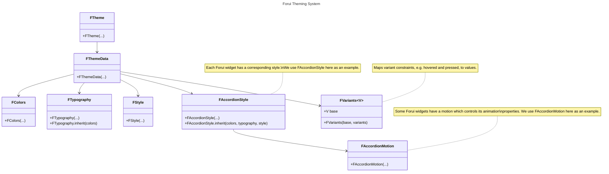

import {Callout} from "fumadocs-ui/components/callout";
import { CodeSnippet } from '@/components/code-snippet/code-snippet';
import gettingStartedSnippet from '@/snippets/snippets/core_concepts/themes/getting_started/getting_started.json';
import componentsSnippet from '@/snippets/snippets/core_concepts/themes/components/components.json';
import colorsSnippet from '@/snippets/snippets/core_concepts/themes/components/colors.json';
import typographySnippet from '@/snippets/snippets/core_concepts/themes/components/typography.json';
import styleSnippet from '@/snippets/snippets/core_concepts/themes/components/style.json';
import variantsSnippet from '@/snippets/snippets/core_concepts/themes/components/variants.json';
import variantsDeltaSnippet from '@/snippets/snippets/core_concepts/themes/components/variants_delta.json';
import mainSnippet from '@/snippets/snippets/core_concepts/themes/customization/themes/main.json';
import themeSnippet from '@/snippets/snippets/core_concepts/themes/customization/themes/theme.json';
import accordionStyleSnippet from '@/snippets/snippets/core_concepts/themes/customization/themes/accordion_style.json';
import copyWithCallSnippet from '@/snippets/snippets/core_concepts/themes/customization/individual_widget_styles/deltas/copy_with_call.json';
import deltaSnippet from '@/snippets/snippets/core_concepts/themes/customization/individual_widget_styles/deltas/delta.json';
import replaceSnippet from '@/snippets/snippets/core_concepts/themes/customization/individual_widget_styles/deltas/replace.json';
import variantsDeltaApplySnippet from '@/snippets/snippets/core_concepts/themes/customization/individual_widget_styles/deltas/variants_delta.json';
import variantsValueApplySnippet from '@/snippets/snippets/core_concepts/themes/customization/individual_widget_styles/deltas/variants_value.json';
import variantsReplaceSnippet from '@/snippets/snippets/core_concepts/themes/customization/individual_widget_styles/deltas/variants_replace.json';
import modifyStyleSnippet from '@/snippets/snippets/core_concepts/themes/customization/individual_widget_styles/cli/modify_style.json';
import passStyleSnippet from '@/snippets/snippets/core_concepts/themes/customization/individual_widget_styles/cli/pass_style.json';
import customFontFamilySnippet from '@/snippets/snippets/core_concepts/themes/components/custom_font_family.json';
import brandColorSnippet from '@/snippets/snippets/core_concepts/themes/custom_properties/brand_color.json';
import extensionsSnippet from '@/snippets/snippets/core_concepts/themes/custom_properties/extensions.json';
import getterSnippet from '@/snippets/snippets/core_concepts/themes/custom_properties/getter.json';
import accessPropertiesSnippet from '@/snippets/snippets/core_concepts/themes/custom_properties/access_properties.json';
import copyWithExtensionsSnippet from '@/snippets/snippets/core_concepts/themes/custom_properties/copy_with.json';
import approximateMaterialThemeSnippet from '@/snippets/snippets/core_concepts/themes/material_interop/apporximate_material_theme.json';

export function Theme({title, color}) {
    return (
        <div className="flex items-center space-x-2">
            <div className="h-4 w-4 rounded-full" style={{backgroundColor: color}}/>
            <p className="font-medium">{title}</p>
        </div>
    );
}

Forui themes allow you to define a consistent visual style across your application & widgets. It optionally relies on
the [CLI](/docs/cli) to generate themes and styles that can be directly modified in your project.

## Getting Started

<Callout type="info" title="Theme Brightness">
    Forui does not manage the theme brightness (light or dark) automatically.
    You need to specify the theme explicitly in `FTheme(...)`.

    <CodeSnippet snippet={gettingStartedSnippet} />
</Callout>

Forui includes predefined themes that can be used out of the box. They are heavily inspired by [shadcn/ui](https://ui.shadcn.com/themes).

| Theme                                     | Light Accessor          | Dark Accessor          |
|:------------------------------------------|:------------------------|:-----------------------|
| <Theme title="Neutral" color="#171717" /> | `FThemes.neutral.light` | `FThemes.neutral.dark` |
| <Theme title="Zinc" color="#18181b" />    | `FThemes.zinc.light`    | `FThemes.zinc.dark`    |
| <Theme title="Slate" color="#0f172b" />   | `FThemes.slate.light`   | `FThemes.slate.dark`   |
| <Theme title="Blue" color="#1447E6" />    | `FThemes.blue.light`    | `FThemes.blue.dark`    |
| <Theme title="Green" color="#5ea500" />   | `FThemes.green.light`   | `FThemes.green.dark`   |
| <Theme title="Orange" color="#f54a00" />  | `FThemes.orange.light`  | `FThemes.orange.dark`  |
| <Theme title="Red" color="#e7000b" />     | `FThemes.red.light`     | `FThemes.red.dark`     |
| <Theme title="Rose" color="#ec003f" />    | `FThemes.rose.light`    | `FThemes.rose.dark`    |
| <Theme title="Violet" color="#7f22fe" />  | `FThemes.violet.light`  | `FThemes.violet.dark`  |
| <Theme title="Yellow" color="#fcc800" />  | `FThemes.yellow.light`  | `FThemes.yellow.dark`  |

## Theme Components



There are **7** core components in Forui's theming system.

- **[`FTheme`](https://pub.dev/documentation/forui/latest/forui.theme/FTheme-class.html)**: The root widget that provides the theme data to all widgets in the subtree.
- **[`FThemeData`](https://pub.dev/documentation/forui/latest/forui.theme/FThemeData-class.html)**: Main class that holds:
  - **[`FColors`](https://pub.dev/documentation/forui/latest/forui.theme/FColors-class.html)**: Color scheme including primary, foreground, and background colors.
  - **[`FTypography`](https://pub.dev/documentation/forui/latest/forui.theme/FTypography-class.html)**: Typography settings including font family and text styles.
  - **[`FStyle`](https://pub.dev/documentation/forui/latest/forui.theme/FStyle-class.html)**: Misc. options such as border radius and icon size.
  - **[`FVariants`](https://pub.dev/documentation/forui/latest/forui.theme/FVariants-class.html)**: Maps variant constraints, e.g. hovered and pressed, to
    values.
  - Individual widget styles.
  - Individual widget motions.

A `BuildContext` extension allows `FThemeData` can be accessed via [`context.theme`](https://pub.dev/documentation/forui/latest/forui.theme/FThemeBuildContext.html):

<CodeSnippet snippet={componentsSnippet} />

### Colors

The `FColors` class contains the theme's color scheme. Colors come in **pairs** - a main color and its corresponding
foreground color for text and icons.

For example:

- `primary` (background) + `primaryForeground` (text/icons)
- `secondary` (background) + `secondaryForeground` (text/icons)
- `destructive` (background) + `destructiveForeground` (text/icons)

<CodeSnippet snippet={colorsSnippet} />

#### Hovered and Disabled Colors

To create hovered and disabled color variants, use the [`FColors.hover`](https://pub.dev/documentation/forui/latest/forui.theme/FColors/hover.html)
and [`FColors.disable`](https://pub.dev/documentation/forui/latest/forui.theme/FColors/disable.html) methods.

### Typography

The `FTypography` class contains the theme's typography settings, including the default font family and various text
styles.

<Callout type="info">
    The `TextStyle`s in `FTypography` are based on [Tailwind CSS Font Size](https://tailwindcss.com/docs/font-size).
    For example, `FTypography.sm` is the equivalent of `text-sm` in Tailwind CSS.
</Callout>

`FTypography`'s text styles only specify `fontSize` and `height`. Use `copyWith()` to add colors and other properties:

<CodeSnippet snippet={typographySnippet} />

#### Custom Font Family

Use the `copyWith()` method to change the default font family. As some fonts may have different sizes, the `scale()`
method is provided to quickly scale all the font sizes.

<CodeSnippet snippet={customFontFamilySnippet} />

### Style

The `FStyle` class the theme's miscellaneous styling options such as the default border radius and icon size.

<CodeSnippet snippet={styleSnippet} />

### `FVariants`

`FVariants` lets you define a base value with optional overrides for specific variant constraints.

This is useful for expressing a wide range of styling concepts:
- User interaction states, e.g. hovered, pressed.
- Semantic states, e.g. disabled, error.
- Stylistic variants, e.g. destructive and outlined buttons.
- Platform differences, e.g. touch vs desktop.

Each widget defines its own variant type, e.g. `FTappableVariant` and `FCalendarVariant`, ensuring only valid variants
can be used. Constraints are composed using `.and(...)` and `.not(...)`:

<CodeSnippet snippet={variantsSnippet} />

Variants can also be expressed as deltas (modifications) applied to a base value:

<CodeSnippet snippet={variantsDeltaSnippet} />

Resolution uses a [**tiered most-specific-wins strategy**](https://github.com/duobaseio/forui/blob/main/design_docs/shipped/styling_2.0.md#proposed-solution-1)
which is deterministic and order-independent.

Each variant belongs to one of three tiers:
| Tier | Category    | Examples                          |
|:-----|:------------|:----------------------------------|
| 2    | Semantic    | `disabled`, `selected`, `error`   |
| 1    | Interaction | `hovered`, `focused`, `pressed`   |
| 0    | Platform    | `android`, `iOS`, `web`           |

Higher tiers always take precedence.

For example, given the states `{.disabled, .pressed}`, `.disabled.and(.pressed)` wins over `.pressed` because `disabled`
is a tier 2 (semantic) state which outranks tier 1 (interaction) states.

See [deltas](#deltas) for modifying an `FVariants`.

## Customization

### Themes

The following section demonstrates how to use the [CLI](/docs/cli) generate a **theme** and **widget style** that you can
directly modify to fit your design needs.

We use [`FAccordionStyle`](https://pub.dev/documentation/forui/latest/forui.widgets.accordion/FAccordionStyle-class.html)
as an example, but the same principles apply to all Forui widgets.

#### Generate `main.dart`

Navigate to your project directory.

Run to generate a `main.dart`:

```shell copy
dart run forui init
```

This generates a `main.dart` file where you will add your generated theme:

<CodeSnippet snippet={mainSnippet} />

#### Generate a Theme

Run to generate a theme based on [neutral](#getting-started)'s light variant:

```shell copy
dart run forui theme create neutral-light
```

<Callout type="info">
    Tip: Run `dart run forui theme ls` to see all available themes.
</Callout>

This generates a theme file which you can:

- add to your generated `main.dart`.
- add the generated styles to.

<CodeSnippet snippet={themeSnippet} />

#### Generate a Style

Run to generate a [`FAccordionStyle`](https://pub.dev/documentation/forui/latest/forui.widgets.accordion/FAccordionStyle-class.html):

```shell copy
dart run forui style create accordion
```

<Callout type="info">
    Tip: Run `dart run forui style ls` to see all available styles.
</Callout>

This generates an accordion style file which you can add to your theme:

<CodeSnippet snippet={accordionStyleSnippet} />

### Individual Widget Styles

#### Deltas

All widget styles have corresponding deltas that represent a partial modification to a style. Omitted fields keep the
existing value while provided fields override it. For example,
[`FAccordionStyle`](https://pub.dev/documentation/forui/latest/forui.widgets.accordion/FAccordionStyle-class.html) has a
corresponding [`FAccordionStyleDelta`](https://pub.dev/documentation/forui/latest/forui.widgets.accordion/FAccordionStyleDelta-class.html).
This is recommended for small adjustments to existing styles.

Widgets accept deltas via their `style` parameter. To change an accordion's focused outline color while keeping the rest
of the style intact:

<CodeSnippet snippet={deltaSnippet} />

Since widget styles extend their corresponding deltas, you can also pass a full style to replace the existing one entirely:

<CodeSnippet snippet={replaceSnippet} />

Widget styles contain [`FVariants`](#fvariants) fields that can be modified using an `apply(...)` function that accepts
a sequence of operations to transform the existing `FVariants`. Depending on the variants' type, these operations are
either delta-based modifications or full replacements.

There are **3** ways to modify `FVariants` fields:

Composite types such as `BoxDecoration`, `IconThemeData`, `TextStyle`, and nested styles support delta-based modifications.
To modify an accordion's title text style:

<CodeSnippet snippet={variantsDeltaApplySnippet} />

Atomic types such as `double` and `Color` only support full replacements. To modify a radio's border color:

<CodeSnippet snippet={variantsValueApplySnippet} />

An `FVariants` can also be replaced entirely by passing an `FVariants` via `.value(...)`. To replace an accordion's title
text style:

<CodeSnippet snippet={variantsReplaceSnippet} />

#### CLI

The following section demonstrate how to override an accordion's style. This is recommended for major style overhauls.

Run to generate a widget style:

```shell copy
dart run forui style create accordion
```

<Callout type="info">
    Tip: Run `dart run forui style ls` to see all available styles.
</Callout>

To add an underline to the accordion title when focused, modify the generated style:

<CodeSnippet snippet={modifyStyleSnippet} />

Lastly, pass the modified style to an `FAccordion`:

<CodeSnippet snippet={passStyleSnippet} />


## Custom Properties

Forui themes can be extended with your own application-specific properties using Flutter's [`ThemeExtension`](https://api.flutter.dev/flutter/material/ThemeExtension-class.html)
system.

### Create a Theme Extension

Theme extensions must extend `ThemeExtension` and implement `copyWith()` and `lerp()`.

<CodeSnippet snippet={brandColorSnippet} />

Add the extension to `FThemeData(...)` via its `extensions` parameter:

<CodeSnippet snippet={extensionsSnippet} />

You can also add extensions to existing themes using `copyWith(...)`:

<CodeSnippet snippet={copyWithExtensionsSnippet} />

### Accessing the Properties

Retrieve your custom theme extension via [`extension<T>()`](https://pub.dev/documentation/forui/latest/forui.theme/FThemeData/extension.html):

<CodeSnippet snippet={accessPropertiesSnippet} />

Optionally, we recommend creating a getter on `FThemeData`:

<CodeSnippet snippet={getterSnippet} />

## Material Interoperability

Forui provides **2** ways to convert [`FThemeData`](https://pub.dev/documentation/forui/latest/forui.theme/FThemeData-class.html)
to Material's [`ThemeData`](https://api.flutter.dev/flutter/material/ThemeData-class.html).

This is useful when:

- Using Material widgets within a Forui application.
- Maintaining consistent theming across both Forui and Material components.
- Gradually migrating from Material to Forui.

### `toApproximateMaterialTheme()`

A Forui theme can be converted to a Material theme using
[`toApproximateMaterialTheme()`](https://pub.dev/documentation/forui/latest/forui.theme/FThemeData/toApproximateMaterialTheme.html).

<Callout type="warning">
  The `toApproximateMaterialTheme()` method is marked as experimental. This method can change without prior warning. The
  mapping between Forui and Material themes is done on a best-effort basis, and may not perfectly capture all the nuances
  of a Forui theme.
</Callout>

<CodeSnippet snippet={approximateMaterialThemeSnippet} />

### CLI

Use the CLI to generate a copy of `toApproximateMaterialTheme()` inside your project:

```shell copy
dart run forui snippet create material-mapping
```

This should be preferred when you want to fine-tune the mapping between Forui and Material themes, as it allows you to
modify the generated mapping directly to fit your design needs.
