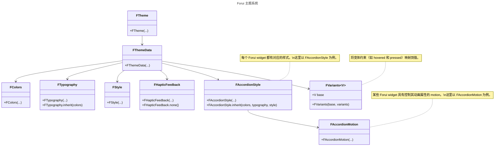

import {Callout} from "fumadocs-ui/components/callout";
import { CodeSnippet } from '@/components/code-snippet/code-snippet';
import gettingStartedSnippet from '@/snippets/snippets/concepts/themes/getting_started/getting_started.json';
import componentsSnippet from '@/snippets/snippets/concepts/themes/components/components.json';
import colorsSnippet from '@/snippets/snippets/concepts/themes/components/colors.json';
import typographySnippet from '@/snippets/snippets/concepts/themes/components/typography.json';
import styleSnippet from '@/snippets/snippets/concepts/themes/components/style.json';
import variantsSnippet from '@/snippets/snippets/concepts/themes/components/variants.json';
import variantsDeltaSnippet from '@/snippets/snippets/concepts/themes/components/variants_delta.json';
import customFontFamilySnippet from '@/snippets/snippets/concepts/themes/components/custom_font_family.json';
import approximateMaterialThemeSnippet from '@/snippets/snippets/concepts/themes/material_interop/approximate_material_theme.json';

export function Theme({title, color}) {
    return (
        <div className="flex items-center space-x-2">
            <div className="h-4 w-4 rounded-full" style={{backgroundColor: color}}/>
            <p className="font-medium">{title}</p>
        </div>
    );
}

Forui 主题让你能够在整个应用与 widget 之间定义一致的视觉风格。它可以选择性地依赖 [CLI](/docs/reference/cli)
来生成主题与样式，并直接在你的项目中修改。

## 开始使用

<Callout type="info" title="主题亮度">
    Forui 不会自动管理主题亮度（浅色或深色）。
    你需要在 `FTheme(...)` 中显式指定使用的主题。

    <CodeSnippet snippet={gettingStartedSnippet} />
</Callout>

Forui 内置了一组开箱即用的预设主题。它们深受 [shadcn/ui](https://ui.shadcn.com/themes) 启发。

| 主题                                      | 浅色访问器              | 深色访问器              |
|:------------------------------------------|:------------------------|:-----------------------|
| <Theme title="Neutral" color="#171717" /> | `FThemes.neutral.light` | `FThemes.neutral.dark` |
| <Theme title="Zinc" color="#18181b" />    | `FThemes.zinc.light`    | `FThemes.zinc.dark`    |
| <Theme title="Slate" color="#0f172b" />   | `FThemes.slate.light`   | `FThemes.slate.dark`   |
| <Theme title="Blue" color="#1447E6" />    | `FThemes.blue.light`    | `FThemes.blue.dark`    |
| <Theme title="Green" color="#5ea500" />   | `FThemes.green.light`   | `FThemes.green.dark`   |
| <Theme title="Orange" color="#f54a00" />  | `FThemes.orange.light`  | `FThemes.orange.dark`  |
| <Theme title="Red" color="#e7000b" />     | `FThemes.red.light`     | `FThemes.red.dark`     |
| <Theme title="Rose" color="#ec003f" />    | `FThemes.rose.light`    | `FThemes.rose.dark`    |
| <Theme title="Violet" color="#7f22fe" />  | `FThemes.violet.light`  | `FThemes.violet.dark`  |
| <Theme title="Yellow" color="#fcc800" />  | `FThemes.yellow.light`  | `FThemes.yellow.dark`  |

每个浅色与深色访问器还包含 desktop 和 touch 变体，其字号与内边距针对相应平台做了优化。
例如，`FThemes.neutral.light.desktop` 是 neutral 浅色主题的桌面变体，
而 `FThemes.neutral.light.touch` 则是触控变体。

更多细节请参阅[响应式](/docs/concepts/responsive)。

## 主题组成部分



Forui 的主题系统中共有 **8** 个核心组件。

- **[`FTheme`](https://pub.dev/documentation/forui/latest/forui.theme/FTheme-class.html)**：根 widget，向子树中所有 widget 提供主题数据。
- **[`FThemeData`](https://pub.dev/documentation/forui/latest/forui.theme/FThemeData-class.html)**：主类，包含：
  - **[`FColors`](https://pub.dev/documentation/forui/latest/forui.theme/FColors-class.html)**：包含主色、前景色与背景色等的配色方案。
  - **[`FTypography`](https://pub.dev/documentation/forui/latest/forui.theme/FTypography-class.html)**：字体系列与文字样式等排版设置。
  - **[`FStyle`](https://pub.dev/documentation/forui/latest/forui.theme/FStyle-class.html)**：杂项设置，例如圆角半径与图标尺寸。
  - **[`FHapticFeedback`](https://pub.dev/documentation/forui/latest/forui.theme/FHapticFeedback-class.html)**：跨多个 widget 共享的触觉反馈回调。
  - **[`FVariants`](https://pub.dev/documentation/forui/latest/forui.theme/FVariants-class.html)**：将变体约束（例如 hovered 与 pressed）映射到具体值。
  - 各个 widget 的样式。
  - 各个 widget 的 motion。

通过一个 `BuildContext` 扩展，可以借助 [`context.theme`](https://pub.dev/documentation/forui/latest/forui.theme/FThemeBuildContext.html) 访问 `FThemeData`：

<CodeSnippet snippet={componentsSnippet} />

### 颜色

`FColors` 类包含主题的配色方案。颜色是**成对**出现的：一种主色和与之配套的、用于文字与图标的前景色。

例如：

- `primary`（背景）+ `primaryForeground`（文字/图标）
- `secondary`（背景）+ `secondaryForeground`（文字/图标）
- `destructive`（背景）+ `destructiveForeground`（文字/图标）

<CodeSnippet snippet={colorsSnippet} />

#### 悬浮与禁用颜色

要创建悬浮与禁用的颜色变体，请使用 [`FColors.hover`](https://pub.dev/documentation/forui/latest/forui.theme/FColors/hover.html)
与 [`FColors.disable`](https://pub.dev/documentation/forui/latest/forui.theme/FColors/disable.html) 方法。

### 排版

`FTypography` 类包含主题的排版设置，包括默认字体系列与各种文字样式。

<Callout type="info">
    `FTypography` 中的 `TextStyle` 基于 [Tailwind CSS Font Size](https://tailwindcss.com/docs/font-size)。
    例如，`FTypography.sm` 等同于 Tailwind CSS 中的 `text-sm`。
</Callout>

`FTypography` 的文字样式只指定 `fontSize` 与 `height`。可以通过 `copyWith()` 添加颜色和其他属性：

<CodeSnippet snippet={typographySnippet} />

#### 自定义字体系列

使用 `copyWith()` 方法可以更改默认字体系列。由于不同字体的字号可能存在差异，因此还提供了 `scale()`
方法，可以快速地按比例缩放所有字号。

<CodeSnippet snippet={customFontFamilySnippet} />

### 样式

`FStyle` 类定义了主题的杂项样式选项，例如默认圆角半径与图标尺寸。

<CodeSnippet snippet={styleSnippet} />

### 触觉反馈

`FHapticFeedback` 类持有触觉反馈回调（例如 `selectionClick`、`mediumImpact`），`FPicker`、`FSlider` 和 `FTooltip`
等 widget 在交互时会调用这些回调。在 `FThemeData` 上覆盖它，即可在整个主题范围内自定义或禁用触觉反馈；
传入 `const FHapticFeedback.none()` 即可禁用。

### 变体

`FVariants` 让你能够定义一个基础值，并针对特定的变体约束设置可选的覆盖值。

这对表达多种样式概念非常有用：
- 用户交互状态，例如 hovered、pressed。
- 语义状态，例如 disabled、error。
- 风格变体，例如 destructive 按钮与 outlined 按钮。
- 平台差异，例如 touch 与 desktop。

每个 widget 都定义了自己的变体类型，例如 `FTappableVariant` 与 `FCalendarVariant`，从而保证只能使用合法的变体。
约束可以通过 `.and(...)` 与 `.not(...)` 组合：

<CodeSnippet snippet={variantsSnippet} />

变体也可以表达为施加在基础值之上的增量（修改）：

<CodeSnippet snippet={variantsDeltaSnippet} />

解析采用[**分层、最具体优先**的策略](https://github.com/duobaseio/forui/blob/main/design_docs/shipped/styling_2.0.md#proposed-solution-1)，
该策略具有确定性且与顺序无关。

每个变体都属于以下三个层级中的一个：
| 层级 | 类别        | 示例                              |
|:-----|:------------|:----------------------------------|
| 2    | 语义        | `disabled`、`selected`、`error`   |
| 1    | 交互        | `hovered`、`focused`、`pressed`   |
| 0    | 平台        | `android`、`iOS`、`web`           |

层级越高，优先级越高。

例如，给定状态 `{.disabled, .pressed}`，由于 `disabled` 是层级 2（语义）状态、优先级高于层级 1（交互）状态，
因此 `.disabled.and(.pressed)` 会胜出而非 `.pressed`。

<Callout type="info">
    要了解如何自定义 `FVariants`，请参阅[自定义 widget 样式](/docs/guides/customizing-widget-styles#variants)
    指南。
</Callout>

## Material 互操作

Forui 提供了 **2** 种方式将 [`FThemeData`](https://pub.dev/documentation/forui/latest/forui.theme/FThemeData-class.html)
转换为 Material 的 [`ThemeData`](https://api.flutter.dev/flutter/material/ThemeData-class.html)。

这在以下情况下很有用：
- 在 Forui 应用中使用 Material widget。
- 在 Forui 与 Material 组件之间保持一致的主题。
- 从 Material 逐步迁移到 Forui。

可以通过
[`toApproximateMaterialTheme()`](https://pub.dev/documentation/forui/latest/forui.theme/FThemeData/toApproximateMaterialTheme.html) 将 Forui 主题转换为 Material 主题。

<Callout type="warning">
  该映射尽力而为，可能无法覆盖全部细节，并且可能在不另行通知的情况下发生变化。
</Callout>

<CodeSnippet snippet={approximateMaterialThemeSnippet} />

或者，你也可以使用 CLI 在你的项目中生成一份 `toApproximateMaterialTheme()` 的副本：

```shell copy
dart run forui snippet create material-mapping
```

如果你希望对 Forui 与 Material 主题之间的映射进行精细调整，更推荐这种方式，
因为它允许你直接修改生成的映射，使其契合你的设计需求。
